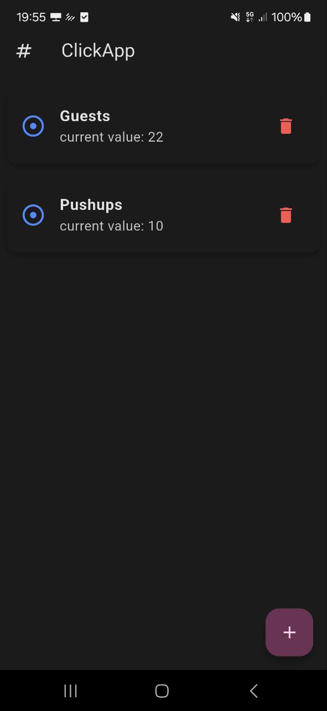
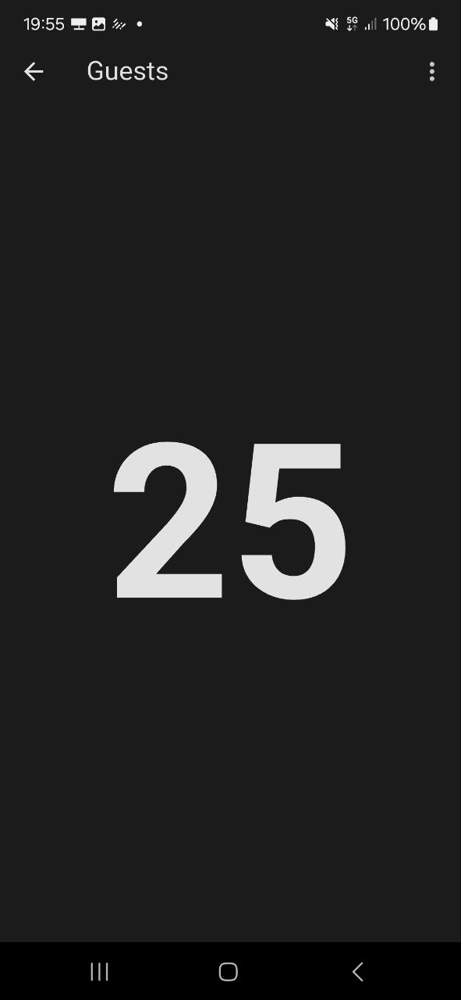
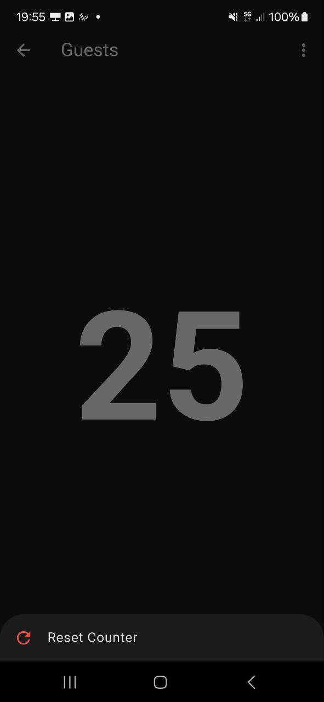

A simple click counter app I made in flutter to start learning it a while back, I tried to stick as best as I could to the **MVVM** pattern.
The app support material 3 dynamics colors

## Screens

in the homescreen there's a list with all created counter, where is possible to see the current value and delete them
 

In the counter screen tap the screen to increase the counter 
 

on the top right there's the setting to reset a coutner
 
